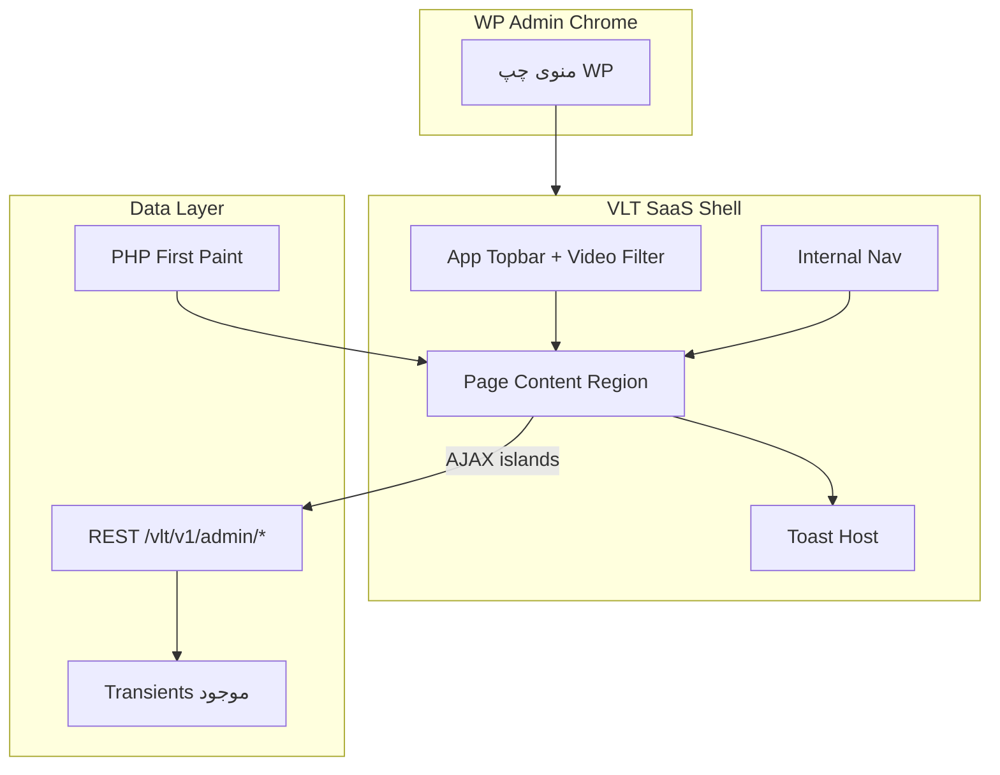

# پلن UI/UX ادمین — Video Lead Tracker (SaaS)

**جهت تأییدشده:** داشبورد سفارشی برنددار (مستقل از ظاهر پیش‌فرض WP Admin) + گرافیک و AJAX برای تعامل‌های پرتکرار، با اولویت UX.

**نسخه فعلی افزونه:** 1.4.5  
**محدوده اصلی:** ۸ صفحه منوی ادمین  
**محدوده فرعی:** هم‌راستاسازی سبک meta boxهای CPT/پست (بدون بازنویسی کامل آن‌ها)

---

## 1. وضعیت فعلی (خلاصه تشخیص)

| صفحه | فایل/متد | مشکل UX اصلی |
|------|----------|--------------|
| Overview | `VLT_Admin::render_overview` | KPI خوب شروع شده؛ `float`/`inline style`؛ فیلتر ویدیو جدا؛ بدون refresh زنده |
| Videos | `VLT_Videos_Admin::render_*` | فرم `form-table` کلاسیک؛ حذف با `confirm`؛ بدون feedback مدرن |
| Leads | `render_lead_list` / `render_lead_detail` | جستجو/صفحه با full reload؛ progress خوب |
| Video Analytics | list + detail | الگوی مشابه Overview؛ توزیع watch استاتیک |
| Funnel | `render_funnel` | انتخاب ویدیو با reload؛ بارهای ساده |
| Heatmap | `render_heatmap` | SVG سمت کلاینت خوب؛ انتخاب ویدیو با reload |
| Settings | `VLT_Settings::render_page` | تب‌ها کار می‌کنند؛ Data Management با `alert` |
| Logs | `render_logs` | فیلتر با reload؛ badge رنگی inline |

**ریشه‌های مشترک**
- HTML بزرگ داخل متدهای PHP بدون partial مشترک
- ده‌ها `style=""` به‌جای design system
- فقط ۳ endpoint ادمین REST (`reset`, `lookup`, `purge-logs`) — بقیه صفحات SSR کامل
- CSS ادمین بدون توکن و بدون RTL؛ در حالی که `languages/video-lead-tracker-fa_IR.po` وجود دارد
- JS با `alert`/`confirm` و استایل inline برای KPI picker

---

## 2. اصول محصول و توقف‌گاه

### اصول UX
1. **یک اپ داخل وردپرس:** روی صفحات `vlt-*` کاربر حس محصول مستقل بگیرد (نه فرم‌های پراکنده WP).
2. **فوری بودن:** فیلتر ویدیو، جستجو، صفحه‌بندی، تعویض متریک heatmap، و سوئیچ Funnel بدون reload کامل.
3. **بازخورد واضح:** toast به‌جای notice پراکنده؛ skeleton هنگام fetch؛ empty state راهنمادار.
4. **RTL-first:** توکن‌ها و layout با logical properties (`margin-inline`, `inset-inline`) تا فارسی درست کار کند.
5. **دسترس‌پذیری:** فوکوس کیبورد، `aria` برای تب/مودال/جدول، کنتراست کافی.

### پذیرش (Acceptance)
- هر ۸ صفحه داخل shell یکسان با ناوبری داخلی و ظاهر SaaS
- فیلتر ویدیو مشترک AJAX روی Overview / Leads / Analytics / Funnel / Heatmap
- Leads: جستجو و pagination با AJAX + حفظ URL (`history.pushState`)
- Funnel و Heatmap: تعویض ویدیو/متریک بدون reload
- Settings و Videos: ذخیره با feedback مدرن؛ عملیات خطرناک با modal تأیید (نه `alert`)
- RTL بدون شکستن layout در `fa_IR`
- بدون وابستگی build جدید (بدون React/Webpack) مگر اینکه بعداً صریحاً درخواست شود

### Non-goals (عمداً خارج از فاز ۱–۳)
- SPA کامل جدا از وردپرس / جدا شدن از `#wpbody`
- بازنویسی frontend عمومی سایت یا Elementor
- داشبورد بلادرنگ WebSocket
- Chart library سنگین (Chart.js/Recharts) مگر کمبود SVG فعلی اثبات شود
- بازنویسی کامل meta boxها به React

---

## 3. معماری پیشنهادی



### تصمیم فنی قفل‌شده
| موضوع | انتخاب | دلیل |
|--------|--------|------|
| فریم‌ورک UI | PHP partials + CSS tokens + Vanilla JS | هم‌راستا با استک فعلی؛ بدون build؛ PHP 7.4 |
| الگوی داده | SSR برای first paint + REST برای تعامل | SEO/ادمین سریع؛ بدون صفحه سفید |
| ناوبری | Shell داخلی + نگه داشتن submenu WP | خروج آسان به بقیه وردپرس؛ UX اپ‌مانند داخل محتوا |
| جداول | جدول سفارشی `.vlt-data-table` (نه فقط `widefat`) | کنترل densisty/RTL/hover/sticky header |
| نمودار | SVG فعلی heatmap + funnel bars ارتقایافته | سبک؛ بدون dependency جدید |

### ساختار فایل جدید

```
includes/Admin/
  class-vlt-admin.php              # منو + orchestration (لاغرتر)
  class-vlt-videos-admin.php
  UI/
    class-vlt-admin-ui.php         # shell, enqueue, body class, helpers
    class-vlt-admin-assets.php     # enqueue CSS/JS chunks
  Views/
    shell.php
    partials/
      page-header.php
      kpi-card.php
      data-table.php
      empty-state.php
      video-filter.php
      toast-host.php
      confirm-modal.php
      skeleton.php
    pages/
      overview.php
      leads-list.php
      leads-detail.php
      ...
assets/css/
  vlt-admin.css                    # tokens + base (یا split)
  vlt-admin-components.css         # اختیاری اگر فایل بزرگ شد
assets/js/
  vlt-admin.js                     # bootstrap
  vlt-admin-api.js                 # fetch wrapper + nonce
  vlt-admin-ui.js                  # toast, modal, tabs, skeleton
  vlt-admin-pages.js               # page controllers (filter/table/heatmap)
includes/API/
  class-vlt-rest-controller.php    # endpoints ادمین جدید
```

Autoload map در `video-lead-tracker.php` برای کلاس‌های `UI/*` به‌روز می‌شود.

---

## 4. Design System (ظاهر SaaS)

### توکن‌های CSS (`:root` داخل scope `.vlt-app`)
- رنگ سطح: `--vlt-bg`, `--vlt-surface`, `--vlt-surface-2`, `--vlt-border`
- متن: `--vlt-text`, `--vlt-text-muted`
- برند: `--vlt-accent` (یک رنگ اصلی ثابت — نه تم بنفش پیش‌فرض AI)
- وضعیت: `--vlt-success`, `--vlt-warning`, `--vlt-danger`, `--vlt-info`
- شعاع/سایه/فاصله: `--vlt-radius`, `--vlt-shadow`, `--vlt-space-*`
- فونت: stack خوانا برای فارسی/لاتین (مثلاً `Vazirmatn` فقط اگر self-host یا سیستم؛ در غیر این صورت stack منطقی بدون CDN اجباری)

**پالت پیشنهادی (قفل):** تیره ملایم سطح محتوا + accent آبی-فیروزه‌ای عمیق (`#0B6E7A` خانواده) — متمایز از WP آبی پیش‌فرض و بدون گرادیان بنفش.

### Shell بصری
روی `body.vlt-admin-screen`:
- محتوای `#wpbody-content .wrap` تبدیل به `.vlt-app` با padding یکدست
- noticeهای WP به toast یا banner داخل shell منتقل/استایل می‌شوند
- هدر صفحه: عنوان + توضیح یک‌خطی + actions (Export / Add / Customize)
- ناوبری داخلی افقی یا ساید باریک برای ۸ آیتم (آیکون + لیبل)

### کامپوننت‌های مشترک
1. **Page Header** — عنوان، breadcrumb (مثلاً Leads → Detail)، actions
2. **KPI Card** — عدد، لیبل، آیکون، delta اختیاری، حالت loading
3. **Video Filter** — select جستجوپذیر (بعداً)؛ تغییر → event `vlt:video-filter`
4. **Data Table** — sticky header، sort indicator، row hover، mobile card-collapse
5. **Badge / Progress / Dist bars** — فقط کلاس، بدون inline color مگر مقدار دینامیک width
6. **Empty State** — آیکون + پیام + CTA (مثلاً «اولین ویدیو را بساز»)
7. **Skeleton** — برای KPI و ردیف جدول
8. **Toast** — success/error/info؛ جایگزین `alert` موفقیت
9. **Confirm Modal** — برای delete/reset/purge
10. **Tabs** — نسخه فعلی ارتقا با نقش ARIA

---

## 5. لایه AJAX / REST

### Endpointهای جدید (`manage_options` + nonce)

| Method | Route | مصرف |
|--------|-------|------|
| GET | `/admin/overview` | KPI + recent leads + top videos (+ `?video=`) |
| GET | `/admin/leads` | لیست صفحه‌بندی‌شده + search/order/video |
| GET | `/admin/leads/{id}` | جزئیات (اختیاری فاز ۲ اگر detail SSR بماند) |
| GET | `/admin/videos-analytics` | لیست آنالیتیکس |
| GET | `/admin/videos-analytics/{id}` | detail + distribution |
| GET | `/admin/funnel?video_id=` | مراحل قیف |
| GET | `/admin/heatmap?video_id=` | buckets (منطق فعلی PHP → JSON) |
| GET | `/admin/logs?level=` | لاگ‌ها |
| موجود | `/admin/reset`, `/lookup`, `/purge-logs` | نگه + UI مدرن |

### قرارداد پاسخ
```json
{ "success": true, "data": { ... }, "meta": { "total": 0, "page": 1 } }
```
خطا: `{ "success": false, "code": "...", "message": "..." }` + toast.

### کلاینت JS
- `vltApi.get/post(path, params)` با `X-WP-Nonce`
- AbortController برای جستجوی debounce (۳۰۰ms)
- همگام‌سازی URL با `history.replaceState` تا لینک‌پذیر بماند
- رویداد مرکزی: `document.dispatchEvent(new CustomEvent('vlt:video-filter', { detail }))`

---

## 6. UX صفحه به صفحه

### Overview
- Shell + KPI row قابل customize (مودال چک‌باکس، نه picker inline با style)
- فیلتر ویدیو در topbar → AJAX refresh KPI و دو پنل
- Empty state اگر ویدیو/لید نباشد
- لینک «View all» به Leads/Analytics با حفظ فیلتر ویدیو

### Videos
- لیست کارتی یا جدول متراکم با وضعیت Active/OTP، پوستر thumbnail، کپی shortcode یک‌کلیک + toast
- فرم Add/Edit دو ستونه: Media | Lead Form | Options (نه یک `form-table` بلند)
- ذخیره: یا POST کلاسیک با redirect + toast، یا AJAX save (ترجیح فاز ۲: AJAX با ماندن روی فرم)
- Delete: confirm modal

### Leads
- Toolbar: search (debounce) + video filter + export
- جدول AJAX؛ کلیک ردیف → detail (SSR detail قابل قبول در فاز ۱؛ AJAX detail فاز ۲)
- Detail: meta strip + جداول نشست/ویدیو با همان کامپوننت‌ها

### Video Analytics
- لیست با progress و لینک detail
- Detail: KPI + distribution + top viewers؛ تعویض ویدیو از فیلتر بدون reload

### Funnel
- انتخاب ویدیو AJAX؛ انیمیشن عرض میله‌ها؛ درصد تبدیل بین مراحل؛ حالت OTP خاموش = مرحله خاکستری با توضیح

### Heatmap
- انتخاب ویدیو AJAX؛ متریک‌ها مثل الان؛ tooltip غنی‌تر؛ empty/select states داخل کارت

### Settings
- تب‌های فعلی داخل کارت SaaS
- Save → toast
- Data Management: کارت‌های خطر با modal تأیید تایپی برای full reset
- Shortcodes: بلوک کپی یک‌کلیک

### Logs
- Chip فیلتر سطح + AJAX؛ رنگ سطح از کلاس `.vlt-badge--error` نه inline
- Purge با modal؛ metadata در drawer یا `<details>` استایل‌شده

### Meta boxes (فاز سبک)
- فقط کلاس‌های توکن/دکمه/پیش‌نمایش پوستر؛ بدون shell کامل

---

## فاز 0 — Foundation — وضعیت: انجام‌شده

پیاده‌سازی شد:
- `VLT_Admin_UI` + body class `vlt-admin-screen`
- Shell / page-header / toast / confirm modal / video-filter partial
- CSS tokens + dark SaaS shell (RTL logical props)
- `vlt-admin-api.js` + `vlt-admin-ui.js`
- REST `GET /vlt/v1/admin/overview`
- Overview با AJAX روی فیلتر ویدیو؛ بقیه صفحات داخل shell legacy

---

## فاز 1 — Analytics surfaces — وضعیت: انجام‌شده

پیاده‌سازی شد:
- `VLT_Admin_Analytics` + REST: `videos-analytics`, `videos-analytics/{id}`, `funnel`, `heatmap`
- صفحات Analytics / Funnel / Heatmap داخل shell SaaS
- AJAX تعویض ویدیو (video_id) بدون reload + empty states
- نوارهای پیشرفت/توزیع/قیف با `--vlt-bar` (بدون رنگ inline)
- `vlt-admin-pages.js` + heatmap remount API

## فاز 2 — Data ops — وضعیت: انجام‌شده

پیاده‌سازی شد:
- REST `admin/leads` + `admin/logs`
- Leads list AJAX (جستجو debounce، sort، pagination، video filter) + detail در shell
- Logs AJAX با badge سطح + purge modal
- Videos: کارت‌های SaaS، کپی shortcode، delete modal، فرم سه‌ستونه
- Settings داخل shell + تب‌های سفارشی + reset/purge با modal/toast

### فاز 3 — Polish — وضعیت: انجام‌شده

پیاده‌سازی شد:
1. Sticky table headers، حالت موبایل ادمین (card-collapse برای Leads/Logs)
2. هماهنگی meta boxها (`.vlt-metabox`)
3. a11y: تب‌ها (ARIA + کیبورد)، مودال (focus trap + restore)
4. به‌روزرسانی رشته‌های `fa_IR.po` برای UI جدید + compile `.mo`
5. افزایش نسخه به 1.4.5 و changelog

هر فاز وقتی Acceptance همان فاز پاس شد متوقف می‌شود؛ فاز بعد فقط با تأیید.

---

## 8. ریسک‌ها و کنترل

| ریسک | کنترل |
|------|--------|
| تداخل با CSS هسته WP | همه استایل‌ها زیر `.vlt-app` / `body.vlt-admin-screen` |
| حجم `class-vlt-admin.php` | استخراج Views؛ متدها فقط داده آماده کنند |
| دوباره‌کاری query | منطق SQL فعلی به متدهای سرویس/هلپر منتقل شود؛ REST و SSR از یک منبع |
| از دست رفتن لینک‌پذیری | همیشه query string با push/replaceState |
| پرش layout هنگام AJAX | skeleton هم‌ارتفاع با KPI/جدول |

---

## 9. ترتیب پیشنهادی PRها
1. `ui-foundation` — shell + tokens + toast/modal + filter event
2. `ui-analytics-ajax` — overview/funnel/heatmap/analytics
3. `ui-leads-logs-videos` — جداول و فرم‌ها
4. `ui-settings-polish` — settings + a11y + fa_IR + meta box touch

---

## 10. گام بعدی بعد از تأیید
شروع **فاز 0** روی branch جدا: پیاده‌سازی shell، توکن‌ها، و اتصال Overview به `/admin/overview` به‌عنوان الگوی مرجع برای بقیه صفحات.
